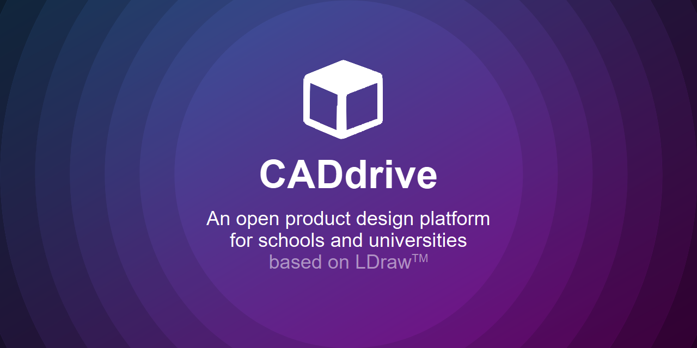

# caddrive

**CADdrive** (see https://caddrive.org and https://caddrive.com) provides an **open source** solution for **collaborative product design**. In the most recent version our platform supports the following features:

- **Member management** for assigning access permissions on product data to our users (using a role-based access control paradigm),
- **Version management** for tracking the evolution of CAD models (currently in [LDraw format](https://ldraw.org/) or [GLTF format](https://www.khronos.org/gltf/), but extensible to other formats as well),
- **Issue management** for task specification and discussion among stakeholders, as well as assignment to project members, and
- **Milestone management** for scheduling task execution and tracking completion across the design project (using time boxing).

In **issue discussions**, you can refer to parts and assemblies of CAD models through **Markdown references**. The references help making the discussion more self-explanatory and easy to understand.

## Documents

Here are some documents to get start with **CADdrive**.

- [**Screenshots**](./documents/Screenshots.md) - see **CADdrive** in action and become a fan 😉
- [**Publications**](./documents/Publications.md) - read articles about **CADdrive** in workshops, conferences, and journals
- [**Diagrams**](./documents/Diagrams.md) - learn about the software architecture of **CADdrive**

If you wish to run **CADdrive** on your computer, read this:

- [**Requirements**](./documents/Requirements.md) - prepare your computer for running **CADdrive**
- [**Depdendencies**](./documents/Dependencies.md) - install dependencies for building and starting **CADdrive**
- [**Executables**](./documents/Executables.md) - start the executables of **CADdrive** on your own computer

And here are some final documents do go through:

* [License](./LICENSE.md)
* [Changelog](./CHANGELOG.md)
* [Contributing](./CONTRIBUTING.md)
