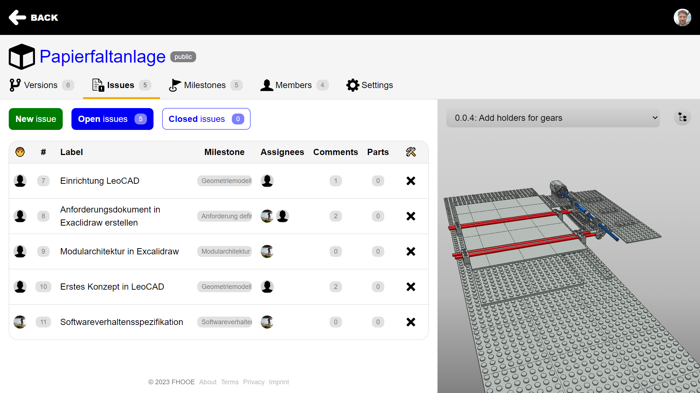
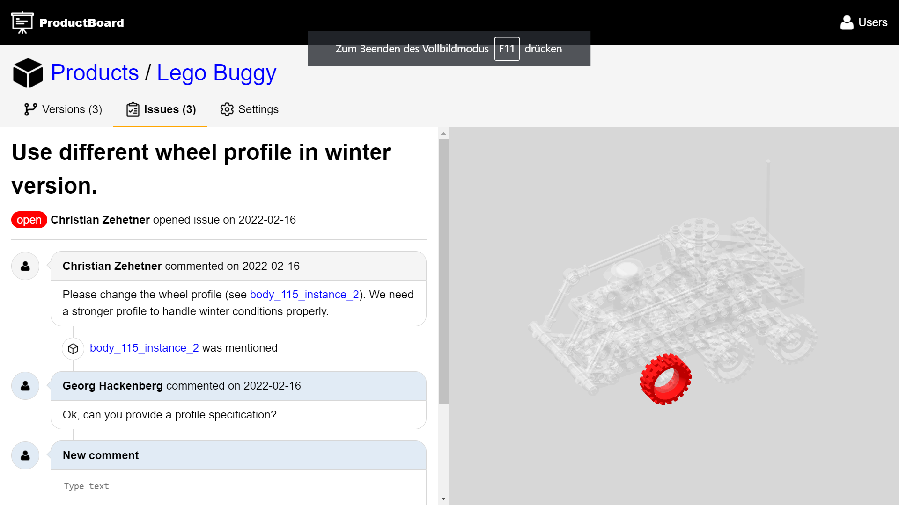

# CADdrive

**CADdrive** (see https://caddrive.org and https://caddrive.com) provides an **open source** solution for **collaborative product design**. In the most recent version our platform supports ...

- **member management** for assigning access permissions on product data to our users (using a role-based access control paradigm),
- **version management** for tracking the evolution of CAD models (currently in [LDraw format](https://ldraw.org/) or [GLTF format](https://www.khronos.org/gltf/), but extensible to other formats as well),
- **issue management** for task specification and discussion among stakeholders, as well as assignment to project members, and
- **milestone management** for scheduling task execution and tracking completion across the design project (using time boxing).

In issue discussions, you can refer to parts and assemblies of CAD models through **Markdown references**. The references help making the discussion more self-explanatory and easy to understand.

## 👨‍🎓 Publications

You can read more about **CADdrive** in the following publications:

### **GitHub for product development - How could that look like?** @ ICED 2023

Read at [Cambridge University Press](https://www.cambridge.org/core/journals/proceedings-of-the-design-society/article/github-for-product-development-how-could-that-look-like/58A5D7A0055D00FA7C265D48C7A2A24F) or cite with our **BibTex entry**:

```bibtex
@article{hackenberg_zehetner_frühwirth_2023,
  title     = {GITHUB FOR PRODUCT DEVELOPMENT - HOW COULD THAT LOOK LIKE?},
  volume    = {3},
  DOI       = {10.1017/pds.2023.206},
  journal   = {Proceedings of the Design Society},
  publisher = {Cambridge University Press},
  author    = {Hackenberg, Georg and Zehetner, Christian and Frühwirth, Dominik},
  year      = {2023},
  pages     = {2055–2064}
}
```

## 📷 Screenshots

### Versions view

The versions view shows the history of the CAD models that have been developed for the product.


### Issues view

The issues view provides an overview of open and closed issues for the product design team.



### Comments view

The comments view enables discussion between stakeholders and engineers around issues.



## 📊 Diagrams

### Package structure

The software exhibits the following package structure:

#### Reduced

This is a reduced version of the diagram:


#### Extended

This is an extended version of the diagram:


### Entity structure

The software implements the following entity structure:


### Model structure

The software implements the following model structure:



## 📃 Requirements

**CADdrive** requires the following tools:

- node@^16
- npm@^9

## 👩‍💻 Scripts

The software provides the following scripts:

### Install dependencies

Install third party dependencies as follows:

```bash
npm install
```

### Start development

Start the software in development mode as follows:

```bash
npm run dev
```

### Start production

Start the software in production mode as follows:

```bash
npm run clean
npm run build

# Mail configuration

export SMTP_HOST=<host name or IP address>
export SMTP_PORT=<port number>
export SMTP_SECURE=<true|false>
export SMTP_AUTH_USER=<user name>
export SMTP_AUTH_PASS=<password>

# Database configuration

export TYPEORM_TYPE=<sqlite|postgres>
# ... for sqlite
export TYPEORM_DATABASE=<path to sqlite database file>
# ... for postgres
export TYPEORM_HOST=<host name or IP address>
export TYPEORM_PORT=<port number>
export TYPEORM_DATABASE=<database name>
export TYPEORM_USERNAME=<user name>
export TYPEORM_PASSWORD=<passwpord>

npm start
```

## 📁 Folders

This repository contains the following folders:

* [Diagrams](diagrams) contains the diagrams shown before
* [Manuscripts](manuscripts) contains manuscripts submitted for publication
* [Packages](packages) contains the actual software code behind CADdrive
* [Screenshots](screenshots) contains the screenshots shown before

## 📑 Documents

Here are some more resources to read through:

* [License](LICENSE.md)
* [Changelog](CHANGELOG.md)
* [Contributing](CONTRIBUTING.md)
