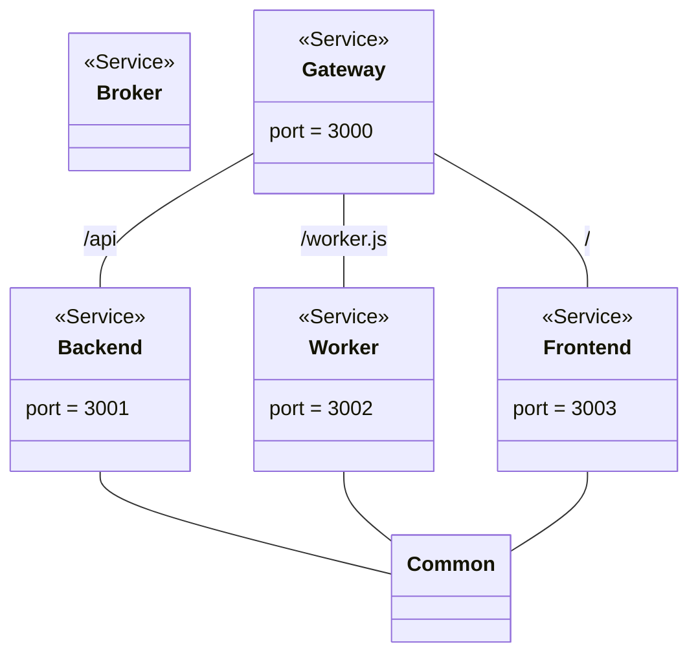

# FH OÖ Product Audit Platform

The FH OÖ Product Audit Platform provides and open source and license cost free solution to collaborative product audits over the Web and in virtual reality (VR).

## Screenshots


## Scripts

Install dependencies.

```
npm install
```

Start development.

```
npm run devel
```

Start production.

```
npm run clean
npm run build
npm start
```

## Diagrams



## Modules

* [Common](./common)
* [Broker](./broker)
* [Backend](./backend)
* [Worker](./worker)
* [Frontend](./frontend)
* [Gateway](./gateway)