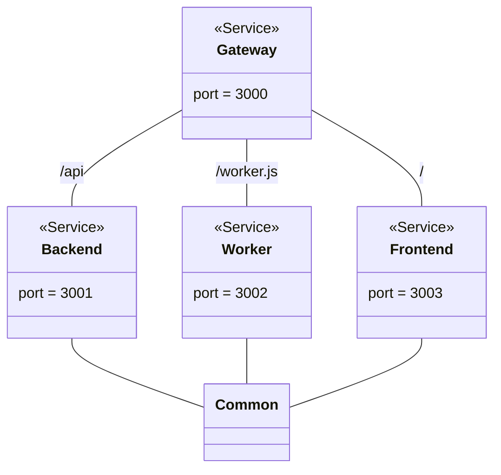

# FH OÖ Audit Platform

TODO

## Scripts

Start production.

```
npm run start
```

Start development.

```
npm run start-dev
```

## Diagrams



## Modules

* [Common](./common)
* [Backend](./backend)
* [Frontend](./frontend)
* [Worker](./worker)
* [Gateway](./gateway)