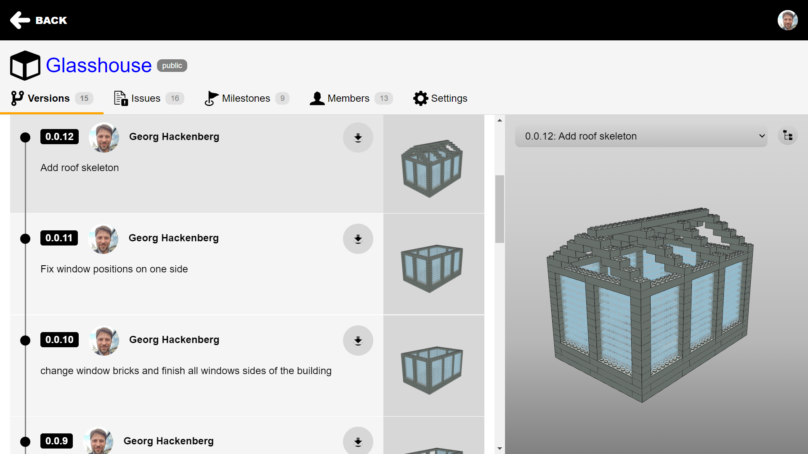
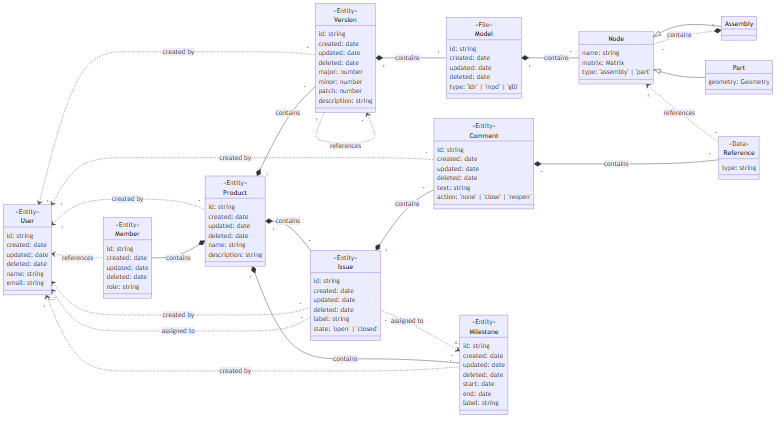

# ProductBoard

ProductBoard provides a free and open source solution for collaborative product design.

## Screenshots

This is what ProductBoard looks like in action.

### Versions view

The versions view shows the history of the product design.



### Issue view

The issue view shows open and closed design tasks.


## Scripts

The software provides the following scripts:

### Install dependencies

Install third party dependencies as follows:

```
npm install
```

### Start development

Start the software in development mode as follows:

```
npm run devel
```

### Start production

Start the software in production mode as follows:

```
npm run clean
npm run build
npm start
```

## Diagrams

### Module structure

The software exhibits the following module structure:


### Data structure

The software implements the following data structure:



## Modules

The software comprises the following modules:

* [Common](common/README.md)
* [Broker](broker/README.md)
* [Backend](backend/README.md)
* [Worker](worker/README.md)
* [Frontend](frontend/README.md)
* [Gateway](gateway/README.md)

## Documenations

Here are some more resources to read through:

* [License](LICENSE.md)
* [Changelog](CHANGELOG.md)
* [Contributing](CONTRIBUTING.md)