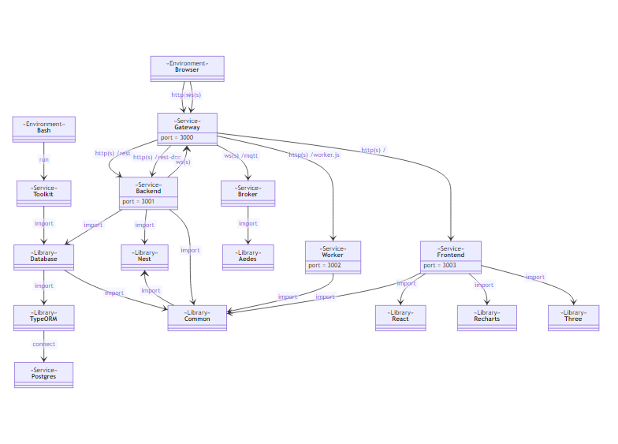

# ProductBoard

ProductBoard provides a free and open source solution for collaborative product design.

## Screenshots

### 📷 Versions view

The versions view shows the history of the CAD models that have been developed for the product.


### 📷 Issues view

The issues view provides an overview of open and closed issues for the product design team.


### 📷 Comments view

The comments view enables discussion between stakeholders and engineers around issues.


## Tools

ProductBoard requires the following tools:

- node@^14.15.0
- npm@^7.20.0

## Scripts

The software provides the following scripts:

### 📄 Install dependencies

Install third party dependencies as follows:

```
npm install
```

### 📄 Start development

Start the software in development mode as follows:

```
npm run devel
```

### 📄 Start production

Start the software in production mode as follows:

```
npm run clean
npm run build
npm start
```

## Diagrams

### 📊 Package structure

The software exhibits the following package structure:



### 📊 Entity structure

The software implements the following entity structure:


## Packages

The software comprises the following packages:

* [Common](packages/common/README.md)
* [Broker](packages/broker/README.md)
* [Backend](packages/backend/README.md)
* [Worker](packages/worker/README.md)
* [Frontend](packages/frontend/README.md)
* [Gateway](packages/gateway/README.md)

## Documenations

Here are some more resources to read through:

* [License](LICENSE.md)
* [Changelog](CHANGELOG.md)
* [Contributing](CONTRIBUTING.md)