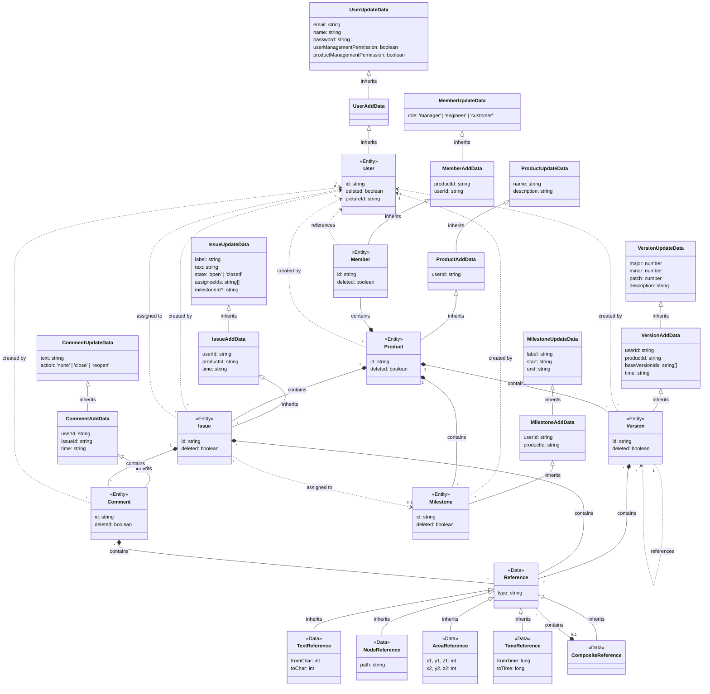

```mermaid
    classDiagram
        direction TB

        class UserUpdateData {
            email: string
            name: string
            password: string
            userManagementPermission: boolean
            productManagementPermission: boolean
        }
        class UserAddData {

        }
        class User {
            id: string
            deleted: boolean
            pictureId: string
        }

        class ProductUpdateData {
            name: string
            description: string
        }
        class ProductAddData {
            userId: string
        }
        class Product {
            id: string
            deleted: boolean
        }

        class MemberUpdateData {
            role: 'manager' | 'engineer' | 'customer'
        }
        class MemberAddData {
            productId: string
            userId: string
        }
        class Member {
            id: string
            deleted: boolean
        }

        class VersionUpdateData {
            major: number
            minor: number
            patch: number
            description: string
        }
        class VersionAddData {
            userId: string
            productId: string
            baseVersionIds: string[]
            time: string
        }
        class Version {
            id: string
            deleted: boolean
        }

        class IssueUpdateData {
            label: string
            text: string
            state: 'open' | 'closed'
            assigneeIds: string[]
            milestoneId?: string
        }
        class IssueAddData {
            userId: string
            productId: string
            time: string
        }
        class Issue {
            id: string
            deleted: boolean
        }

        class CommentUpdateData {
            text: string
            action: 'none' | 'close' | 'reopen'
        }
        class CommentAddData {
            userId: string
            issueId: string
            time: string
        }
        class Comment {
            id: string
            deleted: boolean
        }

        class MilestoneUpdateData {
            label: string
            start: string
            end: string
        }
        class MilestoneAddData {
            userId: string
            productId: string
        }
        class Milestone {
            id: string
            deleted: boolean
        }
        class Reference {
            type: string
        }


        class TextReference {
            fromChar: int
            toChar: int
        }
        class NodeReference {
            path: string
        }
        class AreaReference {
            x1, y1, z1: int
            x2, y2, z2: int
        }
        class TimeReference {
            fromTime: long
            toTime: long
        }
        class CompositeReference {

        }

        <<Entity>> User
        <<Entity>> Product
        <<Entity>> Member
        <<Entity>> Version
        <<Entity>> Issue
        <<Entity>> Comment
        <<Entity>> Milestone

        <<Data>> Reference
        <<Data>> TextReference
        <<Data>> NodeReference
        <<Data>> AreaReference
        <<Data>> TimeReference
        <<Data>> CompositeReference

        UserUpdateData <|-- UserAddData: inherits
        UserAddData <|-- User: inherits
        ProductUpdateData <|-- ProductAddData: inherits
        ProductAddData <|-- Product: inherits
        MemberUpdateData <|-- MemberAddData: inherits
        MemberAddData <|-- Member: inherits
        VersionUpdateData <|-- VersionAddData: inherits
        VersionAddData <|-- Version: inherits
        IssueUpdateData <|-- IssueAddData: inherits
        IssueAddData <|-- Issue: inherits
        CommentUpdateData <|-- CommentAddData: inherits
        CommentAddData <|-- Comment: inherits
        MilestoneUpdateData <|-- MilestoneAddData: inherits
        MilestoneAddData <|-- Milestone: inherits

        Reference <|-- TextReference: inherits
        Reference <|-- NodeReference: inherits
        Reference <|-- AreaReference: inherits
        Reference <|-- TimeReference: inherits
        Reference <|-- CompositeReference: inherits
        Reference "*" --* "0..1" CompositeReference: contains

        User <.. Member : references
        Member --* Product : contains

        Issue "1" *-- "*" Comment : contains
        Product "1" *-- "*" Issue : contains

        User "1" <.. "*" Product : created by
        User "1" <.. "*" Version : created by
        User "1" <.. "*" Issue : created by
        User "1" <.. "*" Comment : created by
        User "1" <.. "*" Milestone : created by
        
        Product "1" *-- "*" Version : contains
        Product "1" *-- "*" Milestone : contains

        Version "1" ..> "*" Version : references
        Version "*" *-- "*" Reference : contains
    
        Issue "*" ..> "0..1" Milestone : assigned to
        Issue "*" ..> "0..1" User : assigned to
        Issue "*" *-- "*" Reference : contains
        Comment "*" *-- "*" Reference : contains

```

