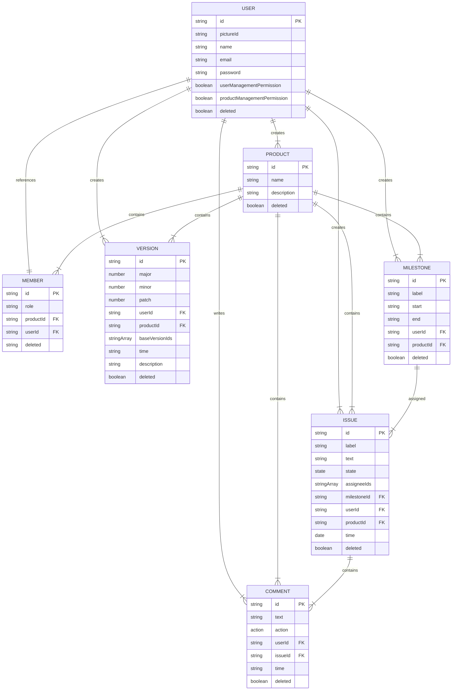

```mermaid
erDiagram
    
    USER ||--|| MEMBER : references
    USER ||--|{ PRODUCT : creates
    USER ||--|{ VERSION : creates 
    USER ||--|{ ISSUE : creates
    USER ||--|{ COMMENT : writes
    USER ||--|{ MILESTONE : creates

    PRODUCT ||--|{ MEMBER : contains
    PRODUCT ||--|{ VERSION : contains
    PRODUCT ||--|{ ISSUE : contains
    PRODUCT ||--|{ MILESTONE : contains
    PRODUCT ||--|{ COMMENT : contains

    ISSUE ||--|{ COMMENT : contains

    MILESTONE ||--|{ ISSUE : assigned

    USER {
        string id PK
        string pictureId 
        string name
        string email
        string password
        boolean userManagementPermission
        boolean productManagementPermission
        boolean deleted
    }
    PRODUCT {
        string id PK
        string name
        string description
        boolean deleted
    }
    MEMBER {
        string id PK
        string role
        string productId FK
        string userId FK
        string deleted
    }
    VERSION {
        string id PK
        number major
        number minor
        number patch
        string userId FK
        string productId FK
        stringArray baseVersionIds
        string time
        string description
        boolean deleted
    }
    ISSUE {
        string id PK
        string label
        string text
        state state
        stringArray assigneeIds
        string milestoneId FK
        string userId FK
        string productId FK
        date time
        boolean deleted
    }
    COMMENT {
        string id PK
        string text
        action action
        string userId FK
        string issueId FK
        string time
        boolean deleted
    }
     MILESTONE {
        string id PK
        string label
        string start
        string end
        string userId FK
        string productId FK
        boolean deleted
    }
```