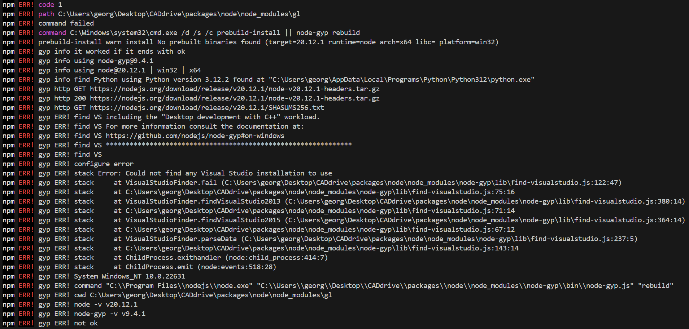
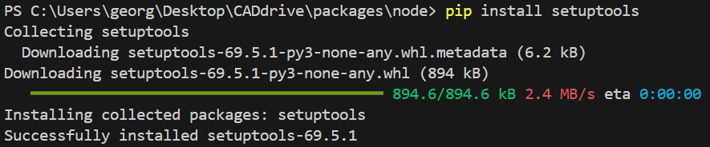

# CADdrive dependencies

Install third party dependencies as follows:

```bash
cd <CADdrive>/packages/node

npm install
```

## ⚠️ Possible errors

###  Microsoft Visual Studio 2017 or newer not found

#### Problem

You might get the following error telling you, that you are missing Visual Studio 2017 or newer and the "Desktop development with C++" workload.



#### Solution

To solve the problem, install Visual Studio and the "Desktop development with C++" workload on your machine.


### Python `distutils` not found

#### Problem


#### Solution

