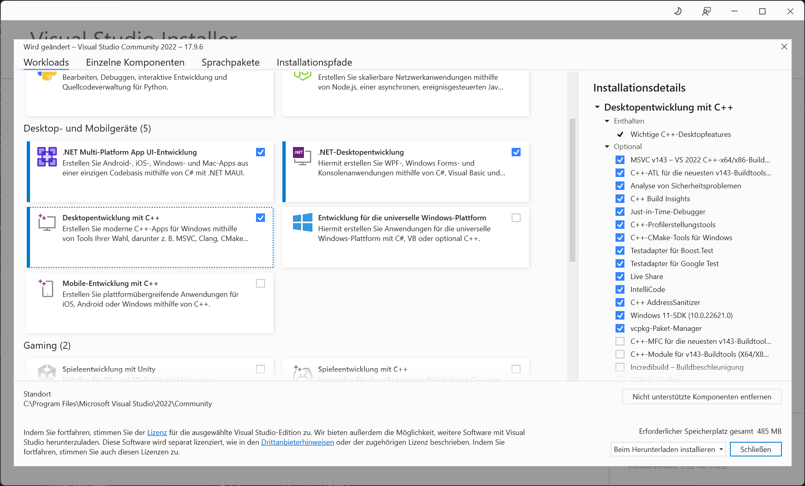
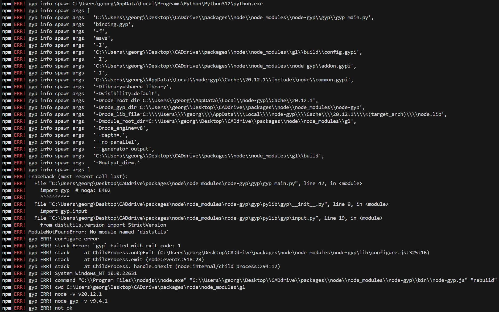

# CADdrive dependencies

Install third party dependencies as follows:

```bash
npm install
```

## ⚠️ Possible errors

###  Microsoft Visual Studio 2017 or newer not found

You might get the following error telling you, that you are missing Visual Studio 2017 or newer and the "Desktop development with C++" workload.


To solve the problem, install Visual Studio and the "Desktop development with C++" workload on your machine using the Visual Studio Installer.



### Python `distutils` not found

During installation of the project dependencies you might also the an error saying that the Python module `distutils` could not be found.



To solve this problem, install the Python package `distutils` into the same Python environment used by your Node.js installation using `pip`.

