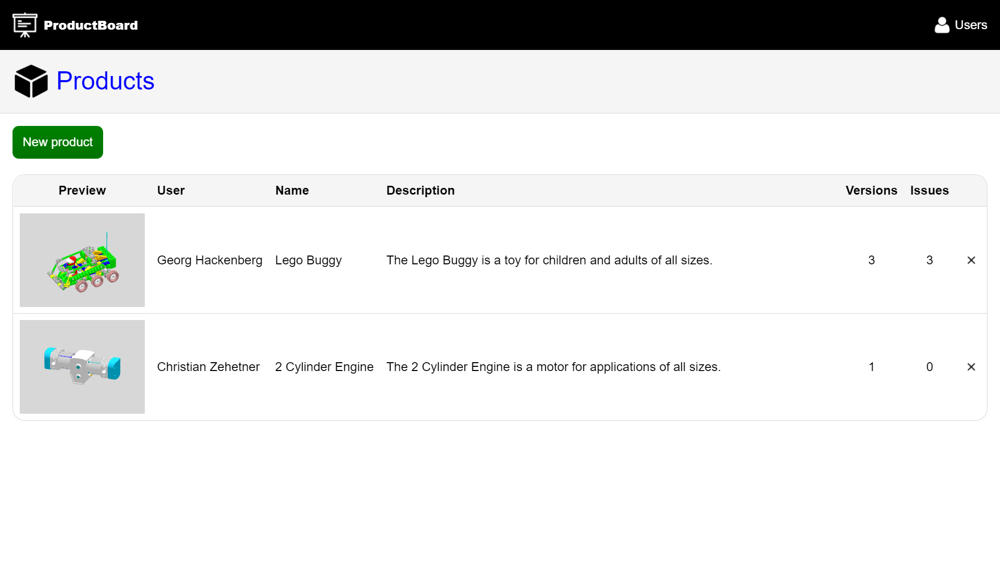
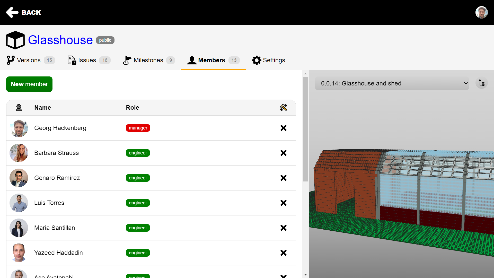

# CADdrive screenshots

In the following, we provide screenshots of different views inside **CADdrive**:

- **Product overview**
- **Version overview**
- **Issue overview** and **issue detail view**
- **Milestone overview** and **milestone detail view**
- **Member overview**

## Product overview

The **product overview** provides an overview of public and private product design projects on the platform.

## Version overview

The **version overview** shows the history of the CAD models that have been developed for the product.

## Issue overview

The **issue overview** provides an overview of open and closed issues for the product design team.

## Issue detail view

The **issue detail view** enables discussion between stakeholders and engineers around issues.

## Milestone overview

The **milestone overview** provides an overview of the time schedule for the product design project.

## Milestone detail view

The **milestone detail view** provides an overview over the open and closed issues as well as a burn down chart.

## Member overview

The **member overview** provides an overview the team members of the product design project and their roles.

