# CADdrive Services

This folder contains additional services required by the CADdrive platform such as **CodeAster** for finite element analysis (FEA), **OpenFOAM** for computational fluid dynamics (CFD), and **ParaView** for visualization of simulation results.

## Scripts

To run the services in development mode:

```sh
cd <CADdrive>

docker-compose up
```

## Services

The following diagram provides an overview of the services included in CADdrive.
For each service the port number and the HTTP route handlers are included.
Furthermore, the diagram shows the interactions between the different services.
Note that the interactions are implemented as HTTP requests and responses.



In the following, we provide some more information about the services and their functionality.

* [LeoFEA](./leofea/) for converting LDraw models to CodeAster models
  * HTTP server listing on ``port 5000``
  * ``HTTP POST /`` for full processing
  * ``HTTP POST /preprocess`` for preprocessing
  * ``HTTP POST /postprocess`` for postprocessing
* [CodeAster](./codeaster/) for producing CodeAster simulation results
  * HTTP server listening on ``port 5001``
  * ``HTTP POST /`` for simulating
* [OpenFOAM](./openfoam/) for producing OpenFOAM simulation results
  * HTTP server listening on ``port 5002``
  * ``HTTP POST /`` for simulating
* [ParaView](./paraview/) for rendering the CodeAster simulation results
  * HTTP server listening on ``port 5003``
  * ``HTTP POST /`` for rendering
